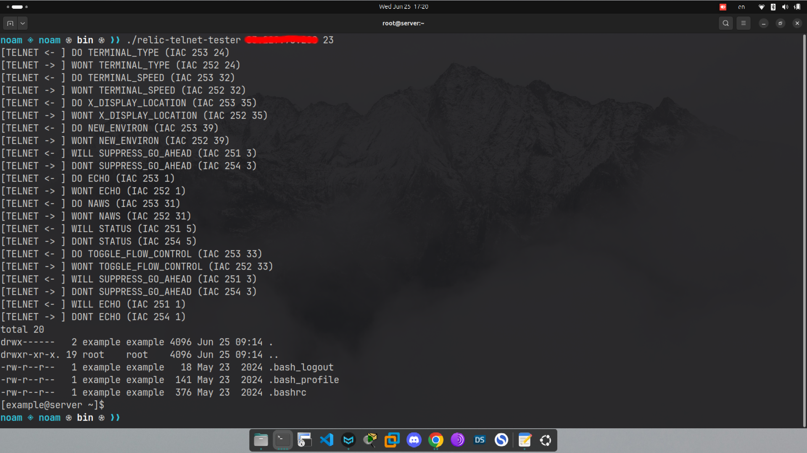

# Build a Telnet client from scratch

> [!IMPORTANT]
> Just a *quick disclaimer* before I continue, I am by no means a good enough **C++**  programmer to tell you how you should write your code, this is hardly my third project in a read programming language and I am fairly new to **C++**, this article is more to guide you with writing one yourself. (In any language)

#### Some background

**Telnet** is a very simple protocol, I think writing a simple telnet client is a great small project to learn a bit more on protocol programming, as for me, I needed to use **Telnet** in another project I am working on and as it seems there is no *go-to* library for holding telnet connections (as oppose to `libssh` for **SSH** for example) and this might be the driven from the simplicity of **Telnet**, and so, I decided to write my own _header only_ library for telnet named `relic-telnet`.

> [!NOTE]
> 
> There is a very nice library on **GitHub** named **[telnetpp](https://github.com/KazDragon/telnetpp)**, I just choose to write my own implementation to be less dependent on other sources.

## The Telnet connection life-cycle

To help you understand the **Telnet** life-cycle I prepared the following diagram:


> Both the **negotiation** and **commands** are sent on the same **TCP** connection.

After creating a **TCP** session on a given port (should be 23), the **Telnet** server should start a **negotiation**, this step ensures the **server** and the **client** agree on a predefined set of rules.

Past the **negotiation** step, you can simply send commands and most **Telnet** servers should interpret the commands as actual commands.

##### The negotiation

**Telnet** can client/server relationships are held by the following _commands_ (based on the [RFC](https://datatracker.ietf.org/doc/html/rfc854#page-14)):

      NAME               CODE              MEANING
      SE                  240    End of subnegotiation parameters.
      NOP                 241    No operation.
      Data Mark           242    The data stream portion of a Synch.
                                 This should always be accompanied
                                 by a TCP Urgent notification.
      Break               243    NVT character BRK.
      Interrupt Process   244    The function IP.
      Abort output        245    The function AO.
      Are You There       246    The function AYT.
      Erase character     247    The function EC.
      Erase Line          248    The function EL.
      Go ahead            249    The GA signal.
      SB                  250    Indicates that what follows is
                                 subnegotiation of the indicated
                                 option.
      WILL (option code)  251    Indicates the desire to begin
                                 performing, or confirmation that
                                 you are now performing, the
                                 indicated option.
      WON'T (option code) 252    Indicates the refusal to perform,
                                 or continue performing, the
                                 indicated option.
      DO (option code)    253    Indicates the request that the
                                 other party perform, or
                                 confirmation that you are expecting
                                 the other party to perform, the
                                 indicated option.
      DON'T (option code) 254    Indicates the demand that the
                                 other party stop performing,
                                 or confirmation that you are no
                                 longer expecting the other party
                                 to perform, the indicated option.
      IAC                 255    Data Byte 255.

But I'll focus on these four:

| Command    | Meaning when sent                     |
|:----------:|:------------------------------------- |
| **IAC**    | Intercept data as command             |
| **DO** X   | Please enable option X on your side.  |
| **DONT** X | Please disable option X on your side. |
| **WILL** X | I will enable option X on my side.    |
| **WONT** X | I won't enable option X on my side.   |

As you might have guessed, these _commands_ are used to enable/disable options on the **client** or **server**, these options define how they should behave, here are some options for example:

| Code | Name                | Description                          |
| ---- | ------------------- | ------------------------------------ |
| 0    | BINARY              | Binary Transmission (8-bit clean)    |
| 1    | ECHO                | Echo input                           |
| 3    | SUPPRESS_GO_AHEAD   | Full-duplex communication            |
| 5    | STATUS              | Request/send option status           |
| 6    | TIMING_MARK         | Synchronization marker               |
| 24   | TERMINAL_TYPE       | Request terminal type (e.g., "ANSI") |
| 31   | NAWS                | Negotiate About Window Size          |
| 32   | TERMINAL_SPEED      | Baud rate negotiation                |
| 33   | TOGGLE_FLOW_CONTROL | Obsolete; flow control               |
| 34   | LINEMODE            | Line-by-line input                   |
| 35   | X_DISPLAY_LOCATION  | Send DISPLAY env var                 |
| 36   | ENVIRONMENT_OPTION  | Deprecated environment support       |
| 39   | NEW_ENVIRON         | Preferred environment support        |

> For a full list of options refer to the [IANA specification](https://www.iana.org/assignments/telnet-options/telnet-options.xhtml).

For the client and server to communicate, the **IAC** byte needs to be send followed by the **command** and then optionally the **option**. 


After the last **IAC** is sent from the server, you have successfully initiated a telnet connection. 

---

## Implementing Telnet

This section would focus on implementing telnet in **C++**, yet I think if you are seasoned enough programmer you can translate this guide to any language.

### First step

As you might know, **C++** does not support networking natively, this means you'd have to use some external libraries to create a **TCP session**, I choose to use the following libraries to do so:

* `sys/socket.h`

* `netinet/in.h`

* `arpa/inet.h`

And wrote this simple class to handle **TCP** connections easily:

```cpp
class tcp {
public:
  tcp(session* owner) : _owner(owner) {}

  unsigned int setSocketAddr(sockaddr_in& server_address) const {
    server_address.sin_family = (_owner->_ipv == 4) ? AF_INET : AF_INET6;
    server_address.sin_port = htons(_owner->_port);

    if (inet_pton(AF_INET, _owner->_address, &server_address.sin_addr) <= 0) {
      return RTELNET_TCP_ERROR_ADDRESS_NOT_VALID;
    }

    return RTELNET_SUCCESS;
  }

  unsigned int Connect(sockaddr_in& address) {
    int sockfd = socket((_owner->_ipv == 4) ? AF_INET : AF_INET6, SOCK_STREAM, 0);
    if (sockfd < 0) return RTELNET_TCP_ERROR_CANNOT_ALOCATE_FD;

    errno = 0;
    if (connect(sockfd, reinterpret_cast<sockaddr*>(&address), sizeof(address)) < 0) { return errno; }

    _owner->_connected = true;
    return sockfd;
  }

  void Close() {
    close(_owner->_fd);
    _owner->_connected = false;
  }

  unsigned int SendBin(const std::vector<unsigned char>& message, int sendFlag = 0) const {
    if (!_owner->_connected) return RTELNET_TCP_ERROR_NOT_CONNECTED;

    errno = 0;
    ssize_t bytesSent = send(_owner->_fd, message.data(), message.size(), sendFlag);

    if (bytesSent == 0) return RTELNET_TCP_ERROR_FAILED_SEND;
    if (static_cast<size_t>(bytesSent) != message.size()) return RTELNET_TCP_ERROR_PARTIAL_SEND;
    if (bytesSent < 0) return errno;

    return RTELNET_SUCCESS;
  }

  unsigned int Send(const std::string& message, int sendFlag = 0) const {
    if (!_owner->_connected) return RTELNET_TCP_ERROR_NOT_CONNECTED;

    std::vector<unsigned char> buffer;
    buffer.reserve(message.size());

    // Escape 255/0xFF
    for (unsigned char c : message) {
      buffer.push_back(c);
      if (c == 255) buffer.push_back(255);
    }

    errno = 0;
    ssize_t bytesSent = send(_owner->_fd, buffer.data(), buffer.size(), sendFlag);

    if (bytesSent == 0) return RTELNET_TCP_ERROR_FAILED_SEND;
    if (bytesSent < 0) return errno;
    if (static_cast<size_t>(bytesSent) != buffer.size()) return RTELNET_TCP_ERROR_PARTIAL_SEND;

    return RTELNET_SUCCESS;
  }

  unsigned int Read(std::vector<unsigned char>& buffer, int readSize = RTELNET_BUFFER_SIZE, int recvFlag = 0) const {
    if (!_owner->_connected) return RTELNET_TCP_ERROR_NOT_CONNECTED;

    buffer.resize(readSize);

    fd_set readfds;
    FD_ZERO(&readfds);
    FD_SET(_owner->_fd, &readfds);

    timeval timeout{};
    timeout.tv_sec = 1;
    timeout.tv_usec = 0;

    int ready = select(_owner->_fd + 1, &readfds, nullptr, nullptr, &timeout);
    if (ready < 0) return errno;
    if (ready == 0) {
      buffer.clear();
      return RTELNET_SUCCESS;
    }

    errno = 0;
    ssize_t bytesRead = recv(_owner->_fd, reinterpret_cast<char*>(buffer.data()), readSize, recvFlag);

    if (bytesRead < 0) return errno;
    if (bytesRead == 0) return RTELNET_TCP_ERROR_CONNECTION_CLOSED_R;

    buffer.resize(bytesRead);
    return RTELNET_SUCCESS;
  }

private:
  session* _owner;
};
```

> It is owned by another class.

This allows me to:

1. Start a **TCP session**.

2. Stop a **TCP session**.

3. Send data over the **TCP session**.

4. Read data from the **TCP session**.

After you have this setup, you can start writing the negotiation sequence.

### Writing the negotiation sequence

For simplicity, I added the following lines to the top of my _header file_:

```cpp
inline constexpr unsigned char IAC                    = 255; // Interpret As Command
inline constexpr unsigned char DO                     = 253; // Please use this option
inline constexpr unsigned char DONT                   = 254; // Please don’t use this option
inline constexpr unsigned char WILL                   = 251; // I will use this option
inline constexpr unsigned char WONT                   = 252; // I won’t use this option
inline constexpr unsigned char SB                     = 250; // Begin subnegotiation
inline constexpr unsigned char SE                     = 240; // End subnegotiation
inline constexpr unsigned char BINARY                 = 0;   // Binary transmission (8-bit clean communication)
inline constexpr unsigned char ECHO                   = 1;   // Echo input back to sender (commonly server-side)
inline constexpr unsigned char SGA                    = 3;   // Suppress Go Ahead (stream mode instead of line mode)
inline constexpr unsigned char STATUS                 = 5;   // Query or send current option status
inline constexpr unsigned char TIMING_MARK            = 6;   // Timing mark for synchronization
inline constexpr unsigned char TERMINAL_TYPE          = 24;  // Exchange terminal type (e.g., "ANSI", "VT100")
inline constexpr unsigned char NAWS                   = 31;  // Negotiate About Window Size (send terminal size)
inline constexpr unsigned char LINEMODE               = 34;  // Line-by-line input mode negotiation
inline constexpr unsigned char NEW_ENVIRON            = 39;  // Send environment variables (supersedes option 36)
inline constexpr unsigned char X_DISPLAY_LOCATION     = 35;  // Send X11 DISPLAY value (e.g., ":0")
inline constexpr unsigned char LOGOUT                 = 18;  // Server requests client logout
inline constexpr unsigned char ENVIRONMENT_OPTION     = 36;  // Deprecated method to send environment variables
inline constexpr unsigned char AUTHENTICATION         = 37;  // Authenticate user via a scheme (e.g., Kerberos)
inline constexpr unsigned char ENCRYPTION             = 38;  // Encrypt the Telnet stream
inline constexpr unsigned char RCP                    = 2;   // Remote Controlled Port (obsolete)
inline constexpr unsigned char NAMS                   = 4;   // Negotiate Approximate Message Size (rare)
inline constexpr unsigned char RCTE                   = 7;   // Remote Controlled Transmission and Echo
inline constexpr unsigned char NAOL                   = 8;   // Output line width setting
inline constexpr unsigned char NAOP                   = 9;   // Output page size
inline constexpr unsigned char NAOCRD                 = 10;  // Carriage return disposition
inline constexpr unsigned char NAOHTS                 = 11;  // Horizontal tab stops
inline constexpr unsigned char NAOHTD                 = 12;  // Horizontal tab disposition
inline constexpr unsigned char NAOFFD                 = 13;  // Formfeed disposition
inline constexpr unsigned char NAOVTS                 = 14;  // Vertical tab stops
inline constexpr unsigned char NAOVTD                 = 15;  // Vertical tab disposition
inline constexpr unsigned char NAOLFD                 = 16;  // Linefeed disposition
inline constexpr unsigned char EXTEND_ASCII           = 17;  // Extended ASCII character set support
inline constexpr unsigned char BM                     = 19;  // Byte macro (macros for command sequences)
inline constexpr unsigned char DET                    = 20;  // Data Entry Terminal mode
inline constexpr unsigned char SUPDUP                 = 21;  // MIT SUPDUP protocol support
inline constexpr unsigned char SUPDUP_OUTPUT          = 22;  // SUPDUP output extension
inline constexpr unsigned char SEND_LOCATION          = 23;  // Send geographic location
inline constexpr unsigned char END_OF_RECORD          = 25;  // Logical end-of-record marker
inline constexpr unsigned char TACACS_UID             = 26;  // User identification via TACACS
inline constexpr unsigned char OUTPUT_MARKING         = 27;  // Marks screen output boundaries
inline constexpr unsigned char TTYLOC                 = 28;  // Send terminal location (TTYLOC)
inline constexpr unsigned char REMOTE_FLOW_CONTROL    = 29;  // Enable/disable flow control remotely
inline constexpr unsigned char XAUTH                  = 41;  // X Window System authentication
inline constexpr unsigned char CHARSET                = 42;  // Negotiate character set
inline constexpr unsigned char RSP                    = 43;  // Remote serial port control
inline constexpr unsigned char COM_PORT_CONTROL       = 44;  // Advanced serial port control
inline constexpr unsigned char SUPPRESS_LOCAL_ECHO    = 45;  // Don't locally echo what we type
inline constexpr unsigned char START_TLS              = 46;  // Upgrade connection to TLS (STARTTLS)
inline constexpr unsigned char KERMIT                 = 47;  // File transfer via Kermit protocol
inline constexpr unsigned char SEND_URL               = 48;  // Send URL string to client
inline constexpr unsigned char FORWARD_X              = 49;  // Forward X11 connections
inline constexpr unsigned char TERMINAL_SPEED         = 32;  // Set terminal baud rate
inline constexpr unsigned char TOGGLE_FLOW_CONTROL    = 33;  // Obsolete; similar to REMOTE_FLOW_CONTROL
inline constexpr unsigned char X3_PAD                 = 30;  // Transmit X.3 PAD parameters
inline constexpr unsigned char MSDP                   = 69;  // Mud Server Data Protocol (used in MUDs)
inline constexpr unsigned char MSSP                   = 70;  // Mud Server Status Protocol
inline constexpr unsigned char ZMP                    = 93;  // Zenith Mud Protocol
inline constexpr unsigned char MUX                    = 95;  // Legacy multi-session support
inline constexpr unsigned char MCCP1                  = 85;  // MUD Client Compression Protocol v1
inline constexpr unsigned char MCCP2                  = 86;  // MUD Client Compression Protocol v2
inline constexpr unsigned char GMCP                   = 201; // Generic Mud Communication Protocol
inline constexpr unsigned char PRAGMA_LOGON           = 138; // Used in Microsoft Telnet (may be in private range)
inline constexpr unsigned char SSPI_LOGON             = 139; // SSPI-based login (Microsoft)
inline constexpr unsigned char PRAGMA_HEARTBEAT       = 140; // Keep-alive negotiation
```

This includes all possible **commands**/**options** for **Telnet**.

At the time of writing this I have yet to implement a **Telnet** option, in preparation for that, for each **option**, I reply with **WONT** or **DONT** respectfully.

First we need to declare a buffer to capture the incoming data:

```cpp
unsigned int Negotiate() {
  if (!_connected) return RTELNET_TCP_ERROR_NOT_CONNECTED;

  std::vector<unsigned char> buffer;
}
```

Then we need to wait in a `while loop` for the incoming data and see if the server is actually trying to negotiate:

```cpp
while (true) {

  // Peek in the buffer
  unsigned int bufferPeek = _tcp.Read(buffer, 3, MSG_PEEK);
  if (bufferPeek != RTELNET_SUCCESS) { return bufferPeek; }

  printTelnet(buffer, 1); // Just prints the TELNET negotiation in readable form

  ssize_t n = static_cast<ssize_t>(buffer.size());
  if (n < 3) return errno;

  // If not a negotiation packet, exit
  if (buffer[0] != IAC) {
    if (!_negotiated) {
      return RTELNET_ERROR_NOT_A_NEGOTIATION;
    } else {
      break;
    }
  }

}
```

Finally we can actually read (and resize the buffer by doing so) from the buffer and reply to the server:

```cpp
unsigned int Negotiate() {
  if (!_connected) return RTELNET_TCP_ERROR_NOT_CONNECTED;

  std::vector<unsigned char> buffer;

  while (true) {

    // Peek in the buffer
    unsigned int bufferPeek = _tcp.Read(buffer, 3, MSG_PEEK);
    if (bufferPeek != RTELNET_SUCCESS) { return bufferPeek; }

    printTelnet(buffer, 1);

    ssize_t n = static_cast<ssize_t>(buffer.size());
    if (n < 3) return errno;

    // If not a negotiation packet, exit
    if (buffer[0] != IAC) {
      if (!_negotiated) {
        return RTELNET_ERROR_NOT_A_NEGOTIATION;
      } else {
        break;
      }
    }

    // Read the full 3-byte sequence
    unsigned int bufferResult = _tcp.Read(buffer, 3);
    if (bufferPeek != RTELNET_SUCCESS) { return bufferPeek; }

    unsigned char command = buffer[1];
    unsigned char option  = buffer[2];
    std::vector<unsigned char> response = {
      static_cast<unsigned char>(IAC),
      static_cast<unsigned char>(0),
      static_cast<unsigned char>(option)
    };

    switch (command) {
      case DO:
        switch (option) {
          case BINARY:               response[1] = WONT; break;
          case ECHO:                 response[1] = WONT; break;
          case SGA:                  response[1] = WONT; break;
          case STATUS:               response[1] = WONT; break;
          case TIMING_MARK:          response[1] = WONT; break;
          case TERMINAL_TYPE:        response[1] = WONT; break;
          case NAWS:                 response[1] = WONT; break;
          case LINEMODE:             response[1] = WONT; break;
          case NEW_ENVIRON:          response[1] = WONT; break;
          case X_DISPLAY_LOCATION:   response[1] = WONT; break;
          case LOGOUT:               response[1] = WONT; break;
          case ENVIRONMENT_OPTION:   response[1] = WONT; break;
          case AUTHENTICATION:       response[1] = WONT; break;
          case ENCRYPTION:           response[1] = WONT; break;
          case RCP:                  response[1] = WONT; break;
          case NAMS:                 response[1] = WONT; break;
          case RCTE:                 response[1] = WONT; break;
          case NAOL:                 response[1] = WONT; break;
          case NAOP:                 response[1] = WONT; break;
          case NAOCRD:               response[1] = WONT; break;
          case NAOHTS:               response[1] = WONT; break;
          case NAOHTD:               response[1] = WONT; break;
          case NAOFFD:               response[1] = WONT; break;
          case NAOVTS:               response[1] = WONT; break;
          case NAOVTD:               response[1] = WONT; break;
          case NAOLFD:               response[1] = WONT; break;
          case EXTEND_ASCII:         response[1] = WONT; break;
          case BM:                   response[1] = WONT; break;
          case DET:                  response[1] = WONT; break;
          case SUPDUP:               response[1] = WONT; break;
          case SUPDUP_OUTPUT:        response[1] = WONT; break;
          case SEND_LOCATION:        response[1] = WONT; break;
          case END_OF_RECORD:        response[1] = WONT; break;
          case TACACS_UID:           response[1] = WONT; break;
          case OUTPUT_MARKING:       response[1] = WONT; break;
          case TTYLOC:               response[1] = WONT; break;
          case REMOTE_FLOW_CONTROL:  response[1] = WONT; break;
          case TOGGLE_FLOW_CONTROL:  response[1] = WONT; break;
          case X3_PAD:               response[1] = WONT; break;
          case MSDP:                 response[1] = WONT; break;
          case MSSP:                 response[1] = WONT; break;
          case ZMP:                  response[1] = WONT; break;
          case MUX:                  response[1] = WONT; break;
          case MCCP1:                response[1] = WONT; break;
          case MCCP2:                response[1] = WONT; break;
          case GMCP:                 response[1] = WONT; break;
          case PRAGMA_LOGON:         response[1] = WONT; break;
          case SSPI_LOGON:           response[1] = WONT; break;
          case PRAGMA_HEARTBEAT:     response[1] = WONT; break;
          default:                   response[1] = WONT; break;
        }
        break;

      case WILL:
        switch (option) {
          case BINARY:               response[1] = DONT; break;
          case ECHO:                 response[1] = DONT; break;
          case SGA:                  response[1] = DONT; break;
          case STATUS:               response[1] = DONT; break;
          case TIMING_MARK:          response[1] = DONT; break;
          case TERMINAL_TYPE:        response[1] = DONT; break;
          case NAWS:                 response[1] = DONT; break;
          case LINEMODE:             response[1] = DONT; break;
          case NEW_ENVIRON:          response[1] = DONT; break;
          case X_DISPLAY_LOCATION:   response[1] = DONT; break;
          case LOGOUT:               response[1] = DONT; break;
          case ENVIRONMENT_OPTION:   response[1] = DONT; break;
          case AUTHENTICATION:       response[1] = DONT; break;
          case ENCRYPTION:           response[1] = DONT; break;
          case RCP:                  response[1] = DONT; break;
          case NAMS:                 response[1] = DONT; break;
          case RCTE:                 response[1] = DONT; break;
          case NAOL:                 response[1] = DONT; break;
          case NAOP:                 response[1] = DONT; break;
          case NAOCRD:               response[1] = DONT; break;
          case NAOHTS:               response[1] = DONT; break;
          case NAOHTD:               response[1] = DONT; break;
          case NAOFFD:               response[1] = DONT; break;
          case NAOVTS:               response[1] = DONT; break;
          case NAOVTD:               response[1] = DONT; break;
          case NAOLFD:               response[1] = DONT; break;
          case EXTEND_ASCII:         response[1] = DONT; break;
          case BM:                   response[1] = DONT; break;
          case DET:                  response[1] = DONT; break;
          case SUPDUP:               response[1] = DONT; break;
          case SUPDUP_OUTPUT:        response[1] = DONT; break;
          case SEND_LOCATION:        response[1] = DONT; break;
          case END_OF_RECORD:        response[1] = DONT; break;
          case TACACS_UID:           response[1] = DONT; break;
          case OUTPUT_MARKING:       response[1] = DONT; break;
          case TTYLOC:               response[1] = DONT; break;
          case REMOTE_FLOW_CONTROL:  response[1] = DONT; break;
          case TOGGLE_FLOW_CONTROL:  response[1] = DONT; break;
          case X3_PAD:               response[1] = DONT; break;
          case MSDP:                 response[1] = DONT; break;
          case MSSP:                 response[1] = DONT; break;
          case ZMP:                  response[1] = DONT; break;
          case MUX:                  response[1] = DONT; break;
          case MCCP1:                response[1] = DONT; break;
          case MCCP2:                response[1] = DONT; break;
          case GMCP:                 response[1] = DONT; break;
          case PRAGMA_LOGON:         response[1] = DONT; break;
          case SSPI_LOGON:           response[1] = DONT; break;
          case PRAGMA_HEARTBEAT:     response[1] = DONT; break;
          default:                   response[1] = DONT; break;
        }
        break;

      case WONT:
      case DONT:
        // Add supprt for these later.
        break;
    }

    _tcp.SendBin(response);
    _negotiated = true;
    printTelnet(response, 0);
  }

  return RTELNET_SUCCESS;
}
```

I added this simple function that makes connecting to the server easier:

```cpp
unsigned int Connect() {
  // Get address
  sockaddr_in address;
  unsigned int addressResult = _tcp.setSocketAddr(address);
  if (addressResult != 0 ) { return addressResult; }

  int fd = _tcp.Connect(address);
  if (fd < 0) { return fd; }
  _fd = fd;

  int negotiateStatus = Negotiate();
  if (negotiateStatus != RTELNET_SUCCESS) return negotiateStatus;

  return RTELNET_SUCCESS;
}
```

Now we can test the `Negotiate` function with this simple tester:

```cpp
/*
 * Relic Telnet is a header only library.
 * This file is only to test the functionality of rtelnet.
 */

#include "rtelnet.hpp"
#include <iostream>

int main(int argc, char *argv[]) {
  if (argc < 2) {
    std::cerr << "[ERROR]: Usage: " << argv[0] << " ADDRESS PORT \n";
    return 1;
  }

  rtnt::session Session;

  Session._address = argv[1];
  Session._port = std::atoi(argv[2]);
  Session._username = "example";
  Session._password = "[nM3r2>W31S_";

  unsigned int connectSuccess = Session.Connect();

  if (connectSuccess != RTELNET_SUCCESS) {
    std::cerr << "[ERROR]: " << rtnt::readError(connectSuccess) << "\n";
    return 1;
  }

  std::cout << "[DONE]\n";

  Session._tcp.Close();
  return 0;
}
```

And after compiling, we can see that we negotiated with the server:

```
noam ◈ noam ⊛ bin ⊛ ❯❯ ./relic-telnet-tester 172.168.1.2 23
[TELNET <- ] DO TERMINAL_TYPE (IAC 253 24)
[TELNET -> ] WONT TERMINAL_TYPE (IAC 252 24)
[TELNET <- ] DO TERMINAL_SPEED (IAC 253 32)
[TELNET -> ] WONT TERMINAL_SPEED (IAC 252 32)
[TELNET <- ] DO X_DISPLAY_LOCATION (IAC 253 35)
[TELNET -> ] WONT X_DISPLAY_LOCATION (IAC 252 35)
[TELNET <- ] DO NEW_ENVIRON (IAC 253 39)
[TELNET -> ] WONT NEW_ENVIRON (IAC 252 39)
[TELNET <- ] WILL SUPPRESS_GO_AHEAD (IAC 251 3)
[TELNET -> ] DONT SUPPRESS_GO_AHEAD (IAC 254 3)
[TELNET <- ] DO ECHO (IAC 253 1)
[TELNET -> ] WONT ECHO (IAC 252 1)
[TELNET <- ] DO NAWS (IAC 253 31)
[TELNET -> ] WONT NAWS (IAC 252 31)
[TELNET <- ] WILL STATUS (IAC 251 5)
[TELNET -> ] DONT STATUS (IAC 254 5)
[TELNET <- ] DO TOGGLE_FLOW_CONTROL (IAC 253 33)
[TELNET -> ] WONT TOGGLE_FLOW_CONTROL (IAC 252 33)
[TELNET <- ] WILL SUPPRESS_GO_AHEAD (IAC 251 3)
[TELNET -> ] DONT SUPPRESS_GO_AHEAD (IAC 254 3)
[TELNET <- ] WILL ECHO (IAC 251 1)
[TELNET -> ] DONT ECHO (IAC 254 1)
[DONE]
```

Nice!

### Logging in

Now that we can negotiate with the server, we can login to a given user.

The login process looks something like this:


Meaning, the server sends in **plane text** the key word _"login:"_, and you simply reply with the **username**, same goes for the password.

For the sake of this operation, I came up with this simple function to capture and expect given data:

```cpp
unsigned int expectOutput(const std::string& expect, std::vector<unsigned char>& buffer) {
    if (!_connected) return RTELNET_TCP_ERROR_NOT_CONNECTED;
    if (!_negotiated) return RTELNET_ERROR_NOT_NEGOTIATED;

    for (int i = 0; i < 300; ++i) {
      unsigned int readStatus = _tcp.Read(buffer);
      if (readStatus != RTELNET_SUCCESS) return readStatus;

      std::string cleanedBuffer(reinterpret_cast<const char*>(buffer.data()), buffer.size());

      cleanedBuffer.erase(std::remove(cleanedBuffer.begin(), cleanedBuffer.end(), '\r'), cleanedBuffer.end());
      cleanedBuffer.erase(std::remove(cleanedBuffer.begin(), cleanedBuffer.end(), '\n'), cleanedBuffer.end());

      if (cleanedBuffer.find(expect) != std::string::npos) {
          return RTELNET_SUCCESS;
      }

      std::this_thread::sleep_for(std::chrono::milliseconds(200));
    }

    return RTELNET_ERROR_CANT_FIND_EXPECTED;
}
```

And I then use it in the **Login** function:

```cpp
unsigned int Login() {
  if (!_connected) return RTELNET_TCP_ERROR_NOT_CONNECTED;
  if (!_negotiated) return RTELNET_ERROR_NOT_NEGOTIATED;
  if (_username.empty()) return RTELNET_ERROR_USERNAME_NOT_SET;
  if (_password.empty()) return RTELNET_ERROR_PASSWORD_NOT_SET;

  std::vector<unsigned char> buffer;

  // Enter login
  buffer.clear();
  unsigned int loginStatus = expectOutput("login:", buffer);
  if (loginStatus != RTELNET_SUCCESS) return loginStatus;
  unsigned int loginResponse = _tcp.Send(_username + "\n");
  if (loginResponse != RTELNET_SUCCESS) return loginResponse;

  // Enter password
  buffer.clear();
  unsigned int passwordStatus = expectOutput("Password:", buffer);
  if (passwordStatus != RTELNET_SUCCESS) return passwordStatus;
  unsigned int passwordResponse = _tcp.Send(_password + "\n");
  if (passwordResponse != RTELNET_SUCCESS) return passwordResponse;

  _logged_in = true;

  return RTELNET_SUCCESS;
}
```

We can test this method via the tester:

```cpp
/*
 * Relic Telnet is a header only library.
 * This file is only to test the functionality of rtelnet.
 */

#include "rtelnet.hpp"
#include <iostream>

int main(int argc, char *argv[]) {
  if (argc < 2) {
    std::cerr << "[ERROR]: Usage: " << argv[0] << " ADDRESS PORT \n";
    return 1;
  }

  rtnt::session Session;

  Session._address = argv[1];
  Session._port = std::atoi(argv[2]);
  Session._username = "toker";
  Session._password = "[nM3r2>W31S_";

  unsigned int connectSuccess = Session.Connect();
  if (connectSuccess != RTELNET_SUCCESS) { std::cerr << "[CONNECTION_ERROR]: " << rtnt::readError(connectSuccess) << "\n"; return 1; }

  unsigned int loginSuccess = Session.Login();
  if (loginSuccess != RTELNET_SUCCESS) { std::cerr << "[LOGGIN_ERROR]: " << rtnt::readError(loginSuccess) << "\n"; return 1; }

  std::cout << "[LOGGED IN]\n";

  Session._tcp.Close();
  return 0;
}
```

And after compiling, we can see everything works:

```bash
noam ◈ noam ⊛ bin ⊛ ❯❯ ./relic-telnet-tester 172.168.2.1 23
[TELNET <- ] DO TERMINAL_TYPE (IAC 253 24)
[TELNET -> ] WONT TERMINAL_TYPE (IAC 252 24)
[TELNET <- ] DO TERMINAL_SPEED (IAC 253 32)
[TELNET -> ] WONT TERMINAL_SPEED (IAC 252 32)
[TELNET <- ] DO X_DISPLAY_LOCATION (IAC 253 35)
[TELNET -> ] WONT X_DISPLAY_LOCATION (IAC 252 35)
[TELNET <- ] DO NEW_ENVIRON (IAC 253 39)
[TELNET -> ] WONT NEW_ENVIRON (IAC 252 39)
[TELNET <- ] WILL SUPPRESS_GO_AHEAD (IAC 251 3)
[TELNET -> ] DONT SUPPRESS_GO_AHEAD (IAC 254 3)
[TELNET <- ] DO ECHO (IAC 253 1)
[TELNET -> ] WONT ECHO (IAC 252 1)
[TELNET <- ] DO NAWS (IAC 253 31)
[TELNET -> ] WONT NAWS (IAC 252 31)
[TELNET <- ] WILL STATUS (IAC 251 5)
[TELNET -> ] DONT STATUS (IAC 254 5)
[TELNET <- ] DO TOGGLE_FLOW_CONTROL (IAC 253 33)
[TELNET -> ] WONT TOGGLE_FLOW_CONTROL (IAC 252 33)
[TELNET <- ] WILL SUPPRESS_GO_AHEAD (IAC 251 3)
[TELNET -> ] DONT SUPPRESS_GO_AHEAD (IAC 254 3)
[TELNET <- ] WILL ECHO (IAC 251 1)
[TELNET -> ] DONT ECHO (IAC 254 1)
[LOGGED IN]
```

### Sending commands

Now that we can login, we can start sending commands.

> When sending commands/plane text, any *255 byte* (**0xFF**) should be escaped like this:
> 
> ```
> 255 255 OR 0xFF 0xFF
> ```
> 
> You can see how I implemented that in the `Send` function.
> 
> Reference: https://datatracker.ietf.org/doc/html/rfc854#page-14

One of the biggest issues with sending commands trough a protocol like **Telnet**, which was designed to be used by humans, and not programs is that you never really know when a command has finished executing.

I came up with two solutions:

1. Wait until you get the **prompt** again. (.i.e [root@server ~]#)

2. Wait for a set amount of time, in which no new data was sent.

Both of which have their pros and cons:

**Wait for prompt:**

| **Pros**                                                  | **Cons**                                                         |
| --------------------------------------------------------- | ---------------------------------------------------------------- |
| Reliable if prompt is consistent and unique               | Fails if prompt changes or is hidden                             |
| Clearly signals end of command                            | Breaks if prompt appears in command output (e.g., `cat`, `echo`) |
| Avoids unnecessary delays when prompt appears immediately | Requires parsing logic to detect prompt patterns                 |
|                                                           | Not suitable for devices without a visible or stable prompt      |

**Wait for inactivity timeout:**

| **Pros**                                                 | **Cons**                                                          |
| -------------------------------------------------------- | ----------------------------------------------------------------- |
| Works without relying on a prompt                        | May cut output short on slow or long-running commands             |
| Simple to implement for generic Telnet or shell sessions | Adds unnecessary delay for fast commands                          |
| Avoids prompt parsing or formatting issues               | Requires careful timeout tuning to balance speed and completeness |

In my opinion relying on the prompt is **far inferior** to an **idle timeout**, and so I created this simple function:

```cpp
unsigned int Execute(const std::string& command, std::string& buffer) {
  if (!_connected) return RTELNET_TCP_ERROR_NOT_CONNECTED;
  if (!_negotiated) return RTELNET_ERROR_NOT_NEGOTIATED;
  if (!_logged_in) return RTELNET_ERROR_NOT_LOGGED;

  unsigned int sendStatus = _tcp.Send(command + "\n");
  if (sendStatus != RTELNET_SUCCESS) return sendStatus;

  std::vector<unsigned char> output;
  buffer.clear();

  auto startTime = std::chrono::steady_clock::now();
  auto lastRead = startTime;

  while (true) {
    unsigned int readStatus = _tcp.Read(output);
    if (readStatus != RTELNET_SUCCESS) return readStatus;

    if (!output.empty()) {
      buffer.append(reinterpret_cast<const char*>(output.data()), output.size());
      lastRead = std::chrono::steady_clock::now();
    }

    auto now = std::chrono::steady_clock::now();
    auto idle = std::chrono::duration_cast<std::chrono::milliseconds>(now - lastRead).count();
    auto total = std::chrono::duration_cast<std::chrono::milliseconds>(now - startTime).count();

    if (idle > _idle || total > _timeout) break;

    std::this_thread::sleep_for(std::chrono::milliseconds(50));
  }

  return RTELNET_SUCCESS;
}
```

Designed to wait for the **idle** amount of time, meaning it will stop reading if no new data has arrived within that period or if the total wait time exceeds the overall **timeout**.

Allowing users to easily send commands.

By the nature of this library, I assume users might want to flush the banner/MOD so it wont be caught when you execute the first command.

I came up with this function to solve this issue:

```cpp
unsigned int FlushBanner() {
  if (!_connected) return RTELNET_TCP_ERROR_NOT_CONNECTED;
  if (!_negotiated) return RTELNET_ERROR_NOT_NEGOTIATED;
  if (!_logged_in) return RTELNET_ERROR_NOT_LOGGED;

  std::string buffer;
  unsigned int execStatus = Execute("\n", buffer);
  if (execStatus != RTELNET_SUCCESS) return execStatus;

  return RTELNET_SUCCESS;
}
```

---

### Using the library

Finally, after making sure we **negotiate** and **login**, we can create a simple program that uses the header file:

```cpp
/*
 * Relic Telnet is a header only library.
 * This file is only to test the functionality of rtelnet.
 */

#include "rtelnet.hpp"
#include <iostream>

int main(int argc, char *argv[]) {
  if (argc < 2) {
    std::cerr << "[ERROR]: Usage: " << argv[0] << " ADDRESS PORT \n";
    return 1;
  }

  rtnt::session Session;

  Session._address = argv[1];
  Session._port = std::atoi(argv[2]);
  Session._username = "example";
  Session._password = "[nM3r2>W31S_";

  unsigned int connectSuccess = Session.Connect();
  if (connectSuccess != RTELNET_SUCCESS) { std::cerr << "[CONNECTION_ERROR]: " << rtnt::readError(connectSuccess) << "\n"; return 1; }

  unsigned int loginSuccess = Session.Login();
  if (loginSuccess != RTELNET_SUCCESS) { std::cerr << "[LOGGIN_ERROR]: " << rtnt::readError(loginSuccess) << "\n"; return 1; }

  unsigned int flushSuccess = Session.FlushBanner();
  if (flushSuccess != RTELNET_SUCCESS) { std::cerr << "[FLUSH_BANNER_ERROR]: " << rtnt::readError(flushSuccess) << "\n"; return 1; }

  std::string buffer;
  unsigned int execSuccess = Session.Execute("ls -al", buffer);
  if (execSuccess != RTELNET_SUCCESS) { std::cerr << "[EXEC_ERROR]: " << rtnt::readError(execSuccess) << "\n"; return 1; }

  std::cout << buffer << "\n";

  Session._tcp.Close();
  return 0;
}
```

And after compiling (for the last time ;)), we can see that everything works as expected:

```bash
noam ◈ noam ⊛ build ⊛ ❯❯ cmake ..
-- The CXX compiler identification is GNU 13.3.0
-- Detecting CXX compiler ABI info
-- Detecting CXX compiler ABI info - done
-- Check for working CXX compiler: /usr/bin/c++ - skipped
-- Detecting CXX compile features
-- Detecting CXX compile features - done
-- Configuring done (0.1s)
-- Generating done (0.0s)
-- Build files have been written to: /home/noam/Work_spaces/Personal/chronicle/relic-telnet/build
noam ◈ noam ⊛ build ⊛ ❯❯ make
[ 50%] Building CXX object CMakeFiles/relic-telnet.dir/src/rtelnet.cpp.o
[100%] Linking CXX executable /home/noam/Work_spaces/Personal/chronicle/relic-telnet/bin/relic-telnet-tester
[100%] Built target relic-telnet
noam ◈ noam ⊛ build ⊛ ❯❯ 
```

Execution:



---

<details>
<summary><strong>Full header file as of 25 Jun 2025</strong></summary>

```cpp
/*
* Relic Telnet is a header only telnet client implementation.
*/
#ifndef RTELNET_H
#define RTELNET_H

#include <cerrno>
#include <cstring>
#include <sys/socket.h>
#include <arpa/inet.h>
#include <netinet/in.h>
#include <string>
#include <sys/types.h>
#include <unistd.h>
#include <vector>
#include <algorithm>
#include <chrono>
#include <thread>
#include <sys/select.h>

#include "debug_helpers.hpp"

inline constexpr int RTELNET_PORT                           = 23;
inline constexpr int RTELNET_BUFFER_SIZE                    = 1024;
inline constexpr int RTELNET_IP_VERSION                     = 4;
inline constexpr int RTELNET_IDLE_TIMEOUT                   = 1000;
inline constexpr int RTELNET_TOTAL_TIMEOUT                  = 10000;


// 0 | 200 > 210 : Relic telnet
inline constexpr int RTELNET_SUCCESS                        = 0;
inline constexpr int RTELNET_ERROR_CANT_FIND_EXPECTED       = 201;

// From 1 to 199 - errno errors

// 210 > : TCP connection errors.
inline constexpr int RTELNET_TCP_ERROR_ADDRESS_NOT_VALID    = 210;
inline constexpr int RTELNET_TCP_ERROR_CANNOT_ALOCATE_FD    = 211;
inline constexpr int RTELNET_TCP_ERROR_CONNECTION_CLOSED_R  = 212;
inline constexpr int RTELNET_TCP_ERROR_NOT_CONNECTED        = 213;
inline constexpr int RTELNET_TCP_ERROR_FAILED_SEND          = 214;
inline constexpr int RTELNET_TCP_ERROR_PARTIAL_SEND         = 215;

// 300 > : Telnet logic errors.
inline constexpr int RTELNET_ERROR_NOT_A_NEGOTIATION        = 300;
inline constexpr int RTELNET_ERROR_NOT_NEGOTIATED           = 301;
inline constexpr int RTELNET_ERROR_USERNAME_NOT_SET         = 302;
inline constexpr int RTELNET_ERROR_PASSWORD_NOT_SET         = 303;
inline constexpr int RTELNET_ERROR_NOT_LOGGED               = 304;


namespace rtnt {

  inline constexpr unsigned char IAC                    = 255; // Interpret As Command
  inline constexpr unsigned char DO                     = 253; // Please use this option
  inline constexpr unsigned char DONT                   = 254; // Please don’t use this option
  inline constexpr unsigned char WILL                   = 251; // I will use this option
  inline constexpr unsigned char WONT                   = 252; // I won’t use this option
  inline constexpr unsigned char SB                     = 250; // Begin subnegotiation
  inline constexpr unsigned char SE                     = 240; // End subnegotiation
  inline constexpr unsigned char BINARY                 = 0;   // Binary transmission (8-bit clean communication)
  inline constexpr unsigned char ECHO                   = 1;   // Echo input back to sender (commonly server-side)
  inline constexpr unsigned char SGA                    = 3;   // Suppress Go Ahead (stream mode instead of line mode)
  inline constexpr unsigned char STATUS                 = 5;   // Query or send current option status
  inline constexpr unsigned char TIMING_MARK            = 6;   // Timing mark for synchronization
  inline constexpr unsigned char TERMINAL_TYPE          = 24;  // Exchange terminal type (e.g., "ANSI", "VT100")
  inline constexpr unsigned char NAWS                   = 31;  // Negotiate About Window Size (send terminal size)
  inline constexpr unsigned char LINEMODE               = 34;  // Line-by-line input mode negotiation
  inline constexpr unsigned char NEW_ENVIRON            = 39;  // Send environment variables (supersedes option 36)
  inline constexpr unsigned char X_DISPLAY_LOCATION     = 35;  // Send X11 DISPLAY value (e.g., ":0")
  inline constexpr unsigned char LOGOUT                 = 18;  // Server requests client logout
  inline constexpr unsigned char ENVIRONMENT_OPTION     = 36;  // Deprecated method to send environment variables
  inline constexpr unsigned char AUTHENTICATION         = 37;  // Authenticate user via a scheme (e.g., Kerberos)
  inline constexpr unsigned char ENCRYPTION             = 38;  // Encrypt the Telnet stream
  inline constexpr unsigned char RCP                    = 2;   // Remote Controlled Port (obsolete)
  inline constexpr unsigned char NAMS                   = 4;   // Negotiate Approximate Message Size (rare)
  inline constexpr unsigned char RCTE                   = 7;   // Remote Controlled Transmission and Echo
  inline constexpr unsigned char NAOL                   = 8;   // Output line width setting
  inline constexpr unsigned char NAOP                   = 9;   // Output page size
  inline constexpr unsigned char NAOCRD                 = 10;  // Carriage return disposition
  inline constexpr unsigned char NAOHTS                 = 11;  // Horizontal tab stops
  inline constexpr unsigned char NAOHTD                 = 12;  // Horizontal tab disposition
  inline constexpr unsigned char NAOFFD                 = 13;  // Formfeed disposition
  inline constexpr unsigned char NAOVTS                 = 14;  // Vertical tab stops
  inline constexpr unsigned char NAOVTD                 = 15;  // Vertical tab disposition
  inline constexpr unsigned char NAOLFD                 = 16;  // Linefeed disposition
  inline constexpr unsigned char EXTEND_ASCII           = 17;  // Extended ASCII character set support
  inline constexpr unsigned char BM                     = 19;  // Byte macro (macros for command sequences)
  inline constexpr unsigned char DET                    = 20;  // Data Entry Terminal mode
  inline constexpr unsigned char SUPDUP                 = 21;  // MIT SUPDUP protocol support
  inline constexpr unsigned char SUPDUP_OUTPUT          = 22;  // SUPDUP output extension
  inline constexpr unsigned char SEND_LOCATION          = 23;  // Send geographic location
  inline constexpr unsigned char END_OF_RECORD          = 25;  // Logical end-of-record marker
  inline constexpr unsigned char TACACS_UID             = 26;  // User identification via TACACS
  inline constexpr unsigned char OUTPUT_MARKING         = 27;  // Marks screen output boundaries
  inline constexpr unsigned char TTYLOC                 = 28;  // Send terminal location (TTYLOC)
  inline constexpr unsigned char REMOTE_FLOW_CONTROL    = 29;  // Enable/disable flow control remotely
  inline constexpr unsigned char XAUTH                  = 41;  // X Window System authentication
  inline constexpr unsigned char CHARSET                = 42;  // Negotiate character set
  inline constexpr unsigned char RSP                    = 43;  // Remote serial port control
  inline constexpr unsigned char COM_PORT_CONTROL       = 44;  // Advanced serial port control
  inline constexpr unsigned char SUPPRESS_LOCAL_ECHO    = 45;  // Don't locally echo what we type
  inline constexpr unsigned char START_TLS              = 46;  // Upgrade connection to TLS (STARTTLS)
  inline constexpr unsigned char KERMIT                 = 47;  // File transfer via Kermit protocol
  inline constexpr unsigned char SEND_URL               = 48;  // Send URL string to client
  inline constexpr unsigned char FORWARD_X              = 49;  // Forward X11 connections
  inline constexpr unsigned char TERMINAL_SPEED         = 32;  // Set terminal baud rate
  inline constexpr unsigned char TOGGLE_FLOW_CONTROL    = 33;  // Obsolete; similar to REMOTE_FLOW_CONTROL
  inline constexpr unsigned char X3_PAD                 = 30;  // Transmit X.3 PAD parameters
  inline constexpr unsigned char MSDP                   = 69;  // Mud Server Data Protocol (used in MUDs)
  inline constexpr unsigned char MSSP                   = 70;  // Mud Server Status Protocol
  inline constexpr unsigned char ZMP                    = 93;  // Zenith Mud Protocol
  inline constexpr unsigned char MUX                    = 95;  // Legacy multi-session support
  inline constexpr unsigned char MCCP1                  = 85;  // MUD Client Compression Protocol v1
  inline constexpr unsigned char MCCP2                  = 86;  // MUD Client Compression Protocol v2
  inline constexpr unsigned char GMCP                   = 201; // Generic Mud Communication Protocol
  inline constexpr unsigned char PRAGMA_LOGON           = 138; // Used in Microsoft Telnet (may be in private range)
  inline constexpr unsigned char SSPI_LOGON             = 139; // SSPI-based login (Microsoft)
  inline constexpr unsigned char PRAGMA_HEARTBEAT       = 140; // Keep-alive negotiation

  std::string readError(int rtntErrno) {
    if (rtntErrno < 200) { return strerror(errno); }
    switch (rtntErrno) {
      case RTELNET_SUCCESS: return                            "No error.";
      case RTELNET_TCP_ERROR_ADDRESS_NOT_VALID: return        "address is not valid.";
      case RTELNET_TCP_ERROR_CANNOT_ALOCATE_FD: return        "cannot alocate a file descriptor.";
      case RTELNET_TCP_ERROR_CONNECTION_CLOSED_R: return      "Connection closed by remote.";
      case RTELNET_TCP_ERROR_NOT_CONNECTED: return            "connection failed, tcp session was not established.";
      case RTELNET_TCP_ERROR_FAILED_SEND: return              "could not send message. (No errno just 0 bytes sent)";
      case RTELNET_TCP_ERROR_PARTIAL_SEND: return             "message was sent partially.";

      // Telnet logic errors
      case RTELNET_ERROR_NOT_A_NEGOTIATION: return            "a negotiation was called, yet server did not negotiate.";
      case RTELNET_ERROR_NOT_NEGOTIATED: return               "negotiation is required, please negotiate first.";
      case RTELNET_ERROR_NOT_LOGGED: return                   "login is required, please login and try again.";

      // rtelnet specific
      case RTELNET_ERROR_CANT_FIND_EXPECTED: return           "cannot find expected substring in buffer.";
      case RTELNET_ERROR_USERNAME_NOT_SET: return             "username was not set in object.";
      case RTELNET_ERROR_PASSWORD_NOT_SET: return             "password was not set in object.";

      default: return                                         "Unknonw error.";
    }
  }

  class session {
  public:
    int _port    = RTELNET_PORT;
    const char* _address;
    int _ipv     = RTELNET_IP_VERSION;
    std::string _username;
    std::string _password;
    int _idle = RTELNET_IDLE_TIMEOUT;
    int _timeout = RTELNET_TOTAL_TIMEOUT;

    class tcp {
    public:
      tcp(session* owner) : _owner(owner) {}

      unsigned int setSocketAddr(sockaddr_in& server_address) const {
        server_address.sin_family = (_owner->_ipv == 4) ? AF_INET : AF_INET6;
        server_address.sin_port = htons(_owner->_port);

        if (inet_pton(AF_INET, _owner->_address, &server_address.sin_addr) <= 0) {
          return RTELNET_TCP_ERROR_ADDRESS_NOT_VALID;
        }

        return RTELNET_SUCCESS;
      }

      unsigned int Connect(sockaddr_in& address) {
        int sockfd = socket((_owner->_ipv == 4) ? AF_INET : AF_INET6, SOCK_STREAM, 0);
        if (sockfd < 0) return RTELNET_TCP_ERROR_CANNOT_ALOCATE_FD;

        errno = 0;
        if (connect(sockfd, reinterpret_cast<sockaddr*>(&address), sizeof(address)) < 0) { return errno; }

        _owner->_connected = true;
        return sockfd;
      }

      void Close() {
        close(_owner->_fd);
        _owner->_connected = false;
      }

      unsigned int SendBin(const std::vector<unsigned char>& message, int sendFlag = 0) const {
        if (!_owner->_connected) return RTELNET_TCP_ERROR_NOT_CONNECTED;

        errno = 0;
        ssize_t bytesSent = send(_owner->_fd, message.data(), message.size(), sendFlag);

        if (bytesSent == 0) return RTELNET_TCP_ERROR_FAILED_SEND;
        if (static_cast<size_t>(bytesSent) != message.size()) return RTELNET_TCP_ERROR_PARTIAL_SEND;
        if (bytesSent < 0) return errno;

        return RTELNET_SUCCESS;
      }

      unsigned int Send(const std::string& message, int sendFlag = 0) const {
        if (!_owner->_connected) return RTELNET_TCP_ERROR_NOT_CONNECTED;

        std::vector<unsigned char> buffer;
        buffer.reserve(message.size());

        // Escape 255/0xFF
        for (unsigned char c : message) {
          buffer.push_back(c);
          if (c == 255) buffer.push_back(255);
        }

        errno = 0;
        ssize_t bytesSent = send(_owner->_fd, buffer.data(), buffer.size(), sendFlag);

        if (bytesSent == 0) return RTELNET_TCP_ERROR_FAILED_SEND;
        if (bytesSent < 0) return errno;
        if (static_cast<size_t>(bytesSent) != buffer.size()) return RTELNET_TCP_ERROR_PARTIAL_SEND;

        return RTELNET_SUCCESS;
      }

      unsigned int Read(std::vector<unsigned char>& buffer, int readSize = RTELNET_BUFFER_SIZE, int recvFlag = 0) const {
        if (!_owner->_connected) return RTELNET_TCP_ERROR_NOT_CONNECTED;

        buffer.resize(readSize);

        fd_set readfds;
        FD_ZERO(&readfds);
        FD_SET(_owner->_fd, &readfds);

        timeval timeout{};
        timeout.tv_sec = 1;
        timeout.tv_usec = 0;

        int ready = select(_owner->_fd + 1, &readfds, nullptr, nullptr, &timeout);
        if (ready < 0) return errno;
        if (ready == 0) {
          buffer.clear();
          return RTELNET_SUCCESS;
        }

        errno = 0;
        ssize_t bytesRead = recv(_owner->_fd, reinterpret_cast<char*>(buffer.data()), readSize, recvFlag);

        if (bytesRead < 0) return errno;
        if (bytesRead == 0) return RTELNET_TCP_ERROR_CONNECTION_CLOSED_R;

        buffer.resize(bytesRead);
        return RTELNET_SUCCESS;
      }

    private:
      session* _owner;
    };

    // Read-only accessors
    bool isConnected() const { return _connected; }
    bool isNegotiated() const { return _negotiated; }
    bool isLoggedIn() const { return _logged_in; }

    // Constructor that initializes tcp and passes this pointer
    session() : _tcp(this) {}

    tcp _tcp;

    unsigned int Connect() {
      // Get address
      sockaddr_in address;
      unsigned int addressResult = _tcp.setSocketAddr(address);
      if (addressResult != 0 ) { return addressResult; }

      int fd = _tcp.Connect(address);
      if (fd < 0) { return fd; }
      _fd = fd;

      int negotiateStatus = Negotiate();
      if (negotiateStatus != RTELNET_SUCCESS) return negotiateStatus;

      return RTELNET_SUCCESS;
    }

    unsigned int Login() {
      if (!_connected) return RTELNET_TCP_ERROR_NOT_CONNECTED;
      if (!_negotiated) return RTELNET_ERROR_NOT_NEGOTIATED;
      if (_username.empty()) return RTELNET_ERROR_USERNAME_NOT_SET;
      if (_password.empty()) return RTELNET_ERROR_PASSWORD_NOT_SET;

      std::vector<unsigned char> buffer;

      // Enter login
      buffer.clear();
      unsigned int loginStatus = expectOutput("login:", buffer);
      if (loginStatus != RTELNET_SUCCESS) return loginStatus;
      unsigned int loginResponse = _tcp.Send(_username + "\n");
      if (loginResponse != RTELNET_SUCCESS) return loginResponse;

      // Enter password
      buffer.clear();
      unsigned int passwordStatus = expectOutput("Password:", buffer);
      if (passwordStatus != RTELNET_SUCCESS) return passwordStatus;
      unsigned int passwordResponse = _tcp.Send(_password + "\n");
      if (passwordResponse != RTELNET_SUCCESS) return passwordResponse;

      _logged_in = true;

      return RTELNET_SUCCESS;
    }

    unsigned int Execute(const std::string& command, std::string& buffer) {
      if (!_connected) return RTELNET_TCP_ERROR_NOT_CONNECTED;
      if (!_negotiated) return RTELNET_ERROR_NOT_NEGOTIATED;
      if (!_logged_in) return RTELNET_ERROR_NOT_LOGGED;

      unsigned int sendStatus = _tcp.Send(command + "\n");
      if (sendStatus != RTELNET_SUCCESS) return sendStatus;

      std::vector<unsigned char> output;
      buffer.clear();

      auto startTime = std::chrono::steady_clock::now();
      auto lastRead = startTime;

      while (true) {
        unsigned int readStatus = _tcp.Read(output);
        if (readStatus != RTELNET_SUCCESS) return readStatus;

        if (!output.empty()) {
          buffer.append(reinterpret_cast<const char*>(output.data()), output.size());
          lastRead = std::chrono::steady_clock::now();
        }

        auto now = std::chrono::steady_clock::now();
        auto idle = std::chrono::duration_cast<std::chrono::milliseconds>(now - lastRead).count();
        auto total = std::chrono::duration_cast<std::chrono::milliseconds>(now - startTime).count();

        if (idle > _idle || total > _timeout) break;

        std::this_thread::sleep_for(std::chrono::milliseconds(50));
      }

      return RTELNET_SUCCESS;
    }

    unsigned int FlushBanner() {
      if (!_connected) return RTELNET_TCP_ERROR_NOT_CONNECTED;
      if (!_negotiated) return RTELNET_ERROR_NOT_NEGOTIATED;
      if (!_logged_in) return RTELNET_ERROR_NOT_LOGGED;

      std::string buffer;
      unsigned int execStatus = Execute("\n", buffer);
      if (execStatus != RTELNET_SUCCESS) return execStatus;

      return RTELNET_SUCCESS;
    }

  private:
    bool _connected = false;
    bool _negotiated = false;
    bool _logged_in = false;
    int _fd;

    unsigned int Negotiate() {
      if (!_connected) return RTELNET_TCP_ERROR_NOT_CONNECTED;

      std::vector<unsigned char> buffer;

      while (true) {

        // Peek in the buffer
        unsigned int bufferPeek = _tcp.Read(buffer, 3, MSG_PEEK);
        if (bufferPeek != RTELNET_SUCCESS) { return bufferPeek; }

        printTelnet(buffer, 1);

        ssize_t n = static_cast<ssize_t>(buffer.size());
        if (n < 3) return errno;

        // If not a negotiation packet, exit
        if (buffer[0] != IAC) {
          if (!_negotiated) {
            return RTELNET_ERROR_NOT_A_NEGOTIATION;
          } else {
            break;
          }
        }

        // Read the full 3-byte sequence
        unsigned int bufferResult = _tcp.Read(buffer, 3);
        if (bufferPeek != RTELNET_SUCCESS) { return bufferPeek; }

        unsigned char command = buffer[1];
        unsigned char option  = buffer[2];
        std::vector<unsigned char> response = {
          static_cast<unsigned char>(IAC),
          static_cast<unsigned char>(0),
          static_cast<unsigned char>(option)
        };

        switch (command) {
          case DO:
            switch (option) {
              case BINARY:               response[1] = WONT; break;
              case ECHO:                 response[1] = WONT; break;
              case SGA:                  response[1] = WONT; break;
              case STATUS:               response[1] = WONT; break;
              case TIMING_MARK:          response[1] = WONT; break;
              case TERMINAL_TYPE:        response[1] = WONT; break;
              case NAWS:                 response[1] = WONT; break;
              case LINEMODE:             response[1] = WONT; break;
              case NEW_ENVIRON:          response[1] = WONT; break;
              case X_DISPLAY_LOCATION:   response[1] = WONT; break;
              case LOGOUT:               response[1] = WONT; break;
              case ENVIRONMENT_OPTION:   response[1] = WONT; break;
              case AUTHENTICATION:       response[1] = WONT; break;
              case ENCRYPTION:           response[1] = WONT; break;
              case RCP:                  response[1] = WONT; break;
              case NAMS:                 response[1] = WONT; break;
              case RCTE:                 response[1] = WONT; break;
              case NAOL:                 response[1] = WONT; break;
              case NAOP:                 response[1] = WONT; break;
              case NAOCRD:               response[1] = WONT; break;
              case NAOHTS:               response[1] = WONT; break;
              case NAOHTD:               response[1] = WONT; break;
              case NAOFFD:               response[1] = WONT; break;
              case NAOVTS:               response[1] = WONT; break;
              case NAOVTD:               response[1] = WONT; break;
              case NAOLFD:               response[1] = WONT; break;
              case EXTEND_ASCII:         response[1] = WONT; break;
              case BM:                   response[1] = WONT; break;
              case DET:                  response[1] = WONT; break;
              case SUPDUP:               response[1] = WONT; break;
              case SUPDUP_OUTPUT:        response[1] = WONT; break;
              case SEND_LOCATION:        response[1] = WONT; break;
              case END_OF_RECORD:        response[1] = WONT; break;
              case TACACS_UID:           response[1] = WONT; break;
              case OUTPUT_MARKING:       response[1] = WONT; break;
              case TTYLOC:               response[1] = WONT; break;
              case REMOTE_FLOW_CONTROL:  response[1] = WONT; break;
              case TOGGLE_FLOW_CONTROL:  response[1] = WONT; break;
              case X3_PAD:               response[1] = WONT; break;
              case MSDP:                 response[1] = WONT; break;
              case MSSP:                 response[1] = WONT; break;
              case ZMP:                  response[1] = WONT; break;
              case MUX:                  response[1] = WONT; break;
              case MCCP1:                response[1] = WONT; break;
              case MCCP2:                response[1] = WONT; break;
              case GMCP:                 response[1] = WONT; break;
              case PRAGMA_LOGON:         response[1] = WONT; break;
              case SSPI_LOGON:           response[1] = WONT; break;
              case PRAGMA_HEARTBEAT:     response[1] = WONT; break;
              default:                   response[1] = WONT; break;
            }
            break;

          case WILL:
            switch (option) {
              case BINARY:               response[1] = DONT; break;
              case ECHO:                 response[1] = DONT; break;
              case SGA:                  response[1] = DONT; break;
              case STATUS:               response[1] = DONT; break;
              case TIMING_MARK:          response[1] = DONT; break;
              case TERMINAL_TYPE:        response[1] = DONT; break;
              case NAWS:                 response[1] = DONT; break;
              case LINEMODE:             response[1] = DONT; break;
              case NEW_ENVIRON:          response[1] = DONT; break;
              case X_DISPLAY_LOCATION:   response[1] = DONT; break;
              case LOGOUT:               response[1] = DONT; break;
              case ENVIRONMENT_OPTION:   response[1] = DONT; break;
              case AUTHENTICATION:       response[1] = DONT; break;
              case ENCRYPTION:           response[1] = DONT; break;
              case RCP:                  response[1] = DONT; break;
              case NAMS:                 response[1] = DONT; break;
              case RCTE:                 response[1] = DONT; break;
              case NAOL:                 response[1] = DONT; break;
              case NAOP:                 response[1] = DONT; break;
              case NAOCRD:               response[1] = DONT; break;
              case NAOHTS:               response[1] = DONT; break;
              case NAOHTD:               response[1] = DONT; break;
              case NAOFFD:               response[1] = DONT; break;
              case NAOVTS:               response[1] = DONT; break;
              case NAOVTD:               response[1] = DONT; break;
              case NAOLFD:               response[1] = DONT; break;
              case EXTEND_ASCII:         response[1] = DONT; break;
              case BM:                   response[1] = DONT; break;
              case DET:                  response[1] = DONT; break;
              case SUPDUP:               response[1] = DONT; break;
              case SUPDUP_OUTPUT:        response[1] = DONT; break;
              case SEND_LOCATION:        response[1] = DONT; break;
              case END_OF_RECORD:        response[1] = DONT; break;
              case TACACS_UID:           response[1] = DONT; break;
              case OUTPUT_MARKING:       response[1] = DONT; break;
              case TTYLOC:               response[1] = DONT; break;
              case REMOTE_FLOW_CONTROL:  response[1] = DONT; break;
              case TOGGLE_FLOW_CONTROL:  response[1] = DONT; break;
              case X3_PAD:               response[1] = DONT; break;
              case MSDP:                 response[1] = DONT; break;
              case MSSP:                 response[1] = DONT; break;
              case ZMP:                  response[1] = DONT; break;
              case MUX:                  response[1] = DONT; break;
              case MCCP1:                response[1] = DONT; break;
              case MCCP2:                response[1] = DONT; break;
              case GMCP:                 response[1] = DONT; break;
              case PRAGMA_LOGON:         response[1] = DONT; break;
              case SSPI_LOGON:           response[1] = DONT; break;
              case PRAGMA_HEARTBEAT:     response[1] = DONT; break;
              default:                   response[1] = DONT; break;
            }
            break;

          case WONT:
          case DONT:
            // Add supprt for these later.
            break;
        }

        _tcp.SendBin(response);
        _negotiated = true;
        printTelnet(response, 0);
      }

      return RTELNET_SUCCESS;
    }


    unsigned int expectOutput(const std::string& expect, std::vector<unsigned char>& buffer) {
        if (!_connected) return RTELNET_TCP_ERROR_NOT_CONNECTED;
        if (!_negotiated) return RTELNET_ERROR_NOT_NEGOTIATED;

        for (int i = 0; i < 300; ++i) {
          unsigned int readStatus = _tcp.Read(buffer);
          if (readStatus != RTELNET_SUCCESS) return readStatus;

          std::string cleanedBuffer(reinterpret_cast<const char*>(buffer.data()), buffer.size());

          cleanedBuffer.erase(std::remove(cleanedBuffer.begin(), cleanedBuffer.end(), '\r'), cleanedBuffer.end());
          cleanedBuffer.erase(std::remove(cleanedBuffer.begin(), cleanedBuffer.end(), '\n'), cleanedBuffer.end());

          if (cleanedBuffer.find(expect) != std::string::npos) {
              return RTELNET_SUCCESS;
          }

          std::this_thread::sleep_for(std::chrono::milliseconds(200));
        }

        return RTELNET_ERROR_CANT_FIND_EXPECTED;
    }

    friend class tcp;
  };

}
#endif // RTELNET_H
```

</details>

---

#### Thank you for reading this.
